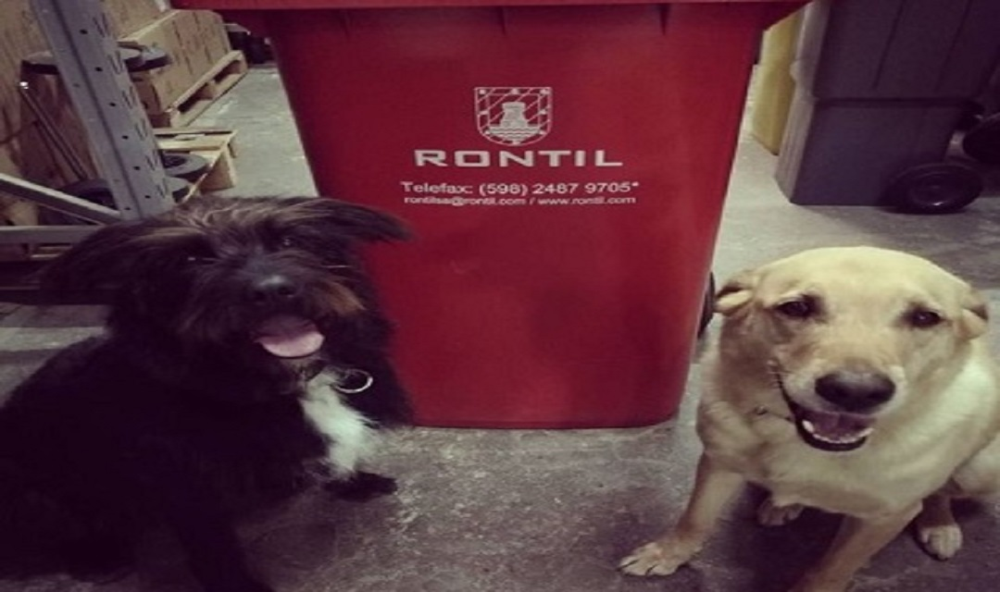

# rontil-web-react: 

## Proyecto de José María Sosa para el curso de React de Coderhouse comisión 38040
### Profesor Conrado Lanusse
### Tutor Santiago Denis

### Link a proyecto subido en Netlify: [Netlify-rontil-web-react](https://jose-maria-sosa-rontil-react-web.netlify.app/)

> Se utiliza Material UI para iconos y algunos pocos estilos. El 95% está estilizado con CSS3.

